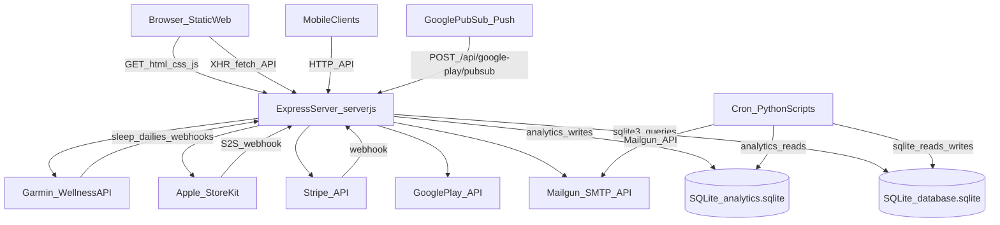

# Architecture

This document is a **high-level architectural overview** of the Moodful codebase in this repository (API + static web frontend + operational scripts).

## What this repo is

- **A single Node/Express server** (`server.js`) that:
  - serves a **JSON API** under `/api/*`
  - serves a **static website** (HTML/CSS/JS) from the `app/` folder
- **A SQLite primary database** (`database.sqlite`) owned by `database.js`
- **A separate SQLite analytics database** (`analytics.sqlite`) owned by `analytics.js`
- **Operational scripts**:
  - `scripts/` (Python): cron-able scheduled jobs (emails, reports, utilities)
  - `maintenance/` (Node): one-off migrations / maintenance tasks

## High-level system diagram



## Runtime components

### Web/API server (`server.js`)

- **Process**: Node.js + Express, listening on **port 3000**
- **Middleware**:
  - `cors` with permissive dev mode and a production allowlist
  - JSON body parsing (`express.json`) and URL-encoded parsing
  - `trust proxy` enabled (`app.set('trust proxy', 1)`)
  - request rate limiting (disabled in dev)
- **Static web serving**: `express.static(path.join(__dirname, 'app'))`
- **Route mounting** (important for endpoint URLs):
  - `authRoutes` mounted at both `/api` and `/api/auth` (aliases)
  - `moodRoutes` mounted at both `/api/moods` and `/api/mood` (aliases)
  - others mounted under `/api/<module>`

### Data layer (`database.js`)

- **Storage**: SQLite file `database.sqlite`
- **Ownership**: `database.js` creates tables at startup and performs additive migrations using `PRAGMA table_info(...)` + `ALTER TABLE ... ADD COLUMN ...`

### Analytics subsystem (`analytics.js`)

- **Storage**: SQLite file `analytics.sqlite`
- **Purpose**: tracks mood submission metadata (`source`, comment length, tags) to support reporting via Python scripts in `scripts/`
- **Write path**: API mood submission calls `trackMoodSubmission(...)` (best-effort; errors are logged)

### Logging (`utils/logger.js`)

- **Implementation**: Winston
- **Outputs**:
  - console (human readable)
  - rotating JSON log files under `logs/` (`combined.log`, `error.log`, plus exception/rejection logs)

## API surface (routes)

All routes are Express routers under `routes/` and are mounted by `server.js`.

### Authentication & account lifecycle (`routes/auth.js`)

Mounted at **`/api/*`** and **`/api/auth/*`** (two prefixes).

- **POST** `/register`: create user, optional Stripe subscription at signup, sends verification email
- **GET** `/verify/:token`: verify email and redirect to `/verified.html`
- **POST** `/login`: issue JWT access token (15m) + refresh token (stored in DB)
- **POST** `/refresh-token`: exchange refresh token for new access token
- **POST** `/logout`: delete refresh token
- **POST** `/forgot-password`: email reset link
- **POST** `/reset-password/:token`: set new password

**DB tables**: `users`, `user_settings`, `refresh_tokens`  
**External dependencies**: Mailgun (via `nodemailer-mailgun-transport`), Stripe (optional at registration)

### Mood CRUD + email auth-code submissions (`routes/moods.js`)

Mounted at **`/api/moods/*`** and **`/api/mood/*`** (two prefixes).

- **POST** `/` (JWT required): create or update the mood for the user’s local day
- **GET** `/` (JWT required): list moods (decrypts `comment` field on read)
- **POST** `/:authCode` (no JWT): create/update mood using a one-time `mood_auth_codes` record (used by email reminders)

**DB tables**: `moods`, `mood_auth_codes`  
**Cross-cutting**: writes analytics entries into `analytics.sqlite` (`trackMoodSubmission`)

### User settings, activities, summaries, Garmin-derived data (`routes/user.js`)

Mounted at **`/api/user/*`**.

- **GET/PUT** `/settings`: profile + notification preferences + AI insight toggle
- **GET/POST** `/activities`: custom activity tags (tier-limited)
- **GET** `/summary`: latest stored summary (decrypts JSON stored in `summaries.basic` and `summaries.advanced`)
- **GET** `/summaries`: all stored summaries
- **GET** `/sleep`: read back sleep summaries ingested from Garmin
- **GET** `/daily-summaries`: read back daily summaries ingested from Garmin
- **GET** `/unsubscribe`: public link for unsubscribing from email notifications
- **DELETE** `/account`: deletes the user and all associated data (transaction-like sequence)

**DB tables**: `users`, `user_settings`, `custom_activities`, `summaries`, `sleep_summaries`, `daily_summaries`, `refresh_tokens`, `moods`, `mood_auth_codes`, `garmin_request_tokens`

### Stripe billing + webhooks (`routes/stripe.js`)

Mounted at **`/api/stripe/*`**.

- **POST** `/webhook`: Stripe webhook receiver (**requires raw request body**; configured in `server.js`)
- **POST** `/upgrade`: create/attach payment method and create subscription
- **POST** `/downgrade`: cancel at period end (actual downgrade via webhook)
- **POST** `/renew`: reverse cancel-at-period-end
- **GET** `/subscription`, **GET** `/subscription-details`: return Stripe subscription state (with extra diagnostics / auto-repair attempts)
- **GET** `/payment-methods`, **POST** `/update-payment-method`, **POST** `/set-default-payment-method`, **DELETE** `/payment-method/:id`

**DB tables**: `users`  
**External dependencies**: Stripe

### Google Play subscriptions + Pub/Sub push (`routes/google-play.js`)

Mounted at **`/api/google-play/*`**.

- **POST** `/verify-purchase`: verify with Google Play Developer API, update user tier
- **POST** `/pubsub`: receive push notifications, map notification types to tier changes
- **GET** `/subscription-status`: fetch latest subscription info for the current user

**DB tables**: `users`  
**External dependencies**: Google APIs (`googleapis`), Pub/Sub push

### Apple Store subscriptions (StoreKit 2) + webhooks (`routes/apple-store.js`)

Mounted at **`/api/apple-store/*`**.

- **POST** `/verify-transaction`: decode StoreKit 2 signed transaction JWT; in dev it may skip signature verification
- **GET** `/subscription-status`: status for the authenticated user
- **POST** `/webhook`: Apple server-to-server notifications (decodes signed payloads; updates tier)

**DB tables**: `users` (`appleSubscriptionId`, `subscriptionExpiresAt`, `accountLevel`)  
**External dependencies**: Apple public keys endpoint (`https://appleid.apple.com/auth/keys`)

### Garmin Connect + Wellness webhooks (`routes/garmin.js`)

Mounted at **`/api/garmin/*`**.

- **POST** `/start-auth` (JWT required): starts Garmin OAuth, stores a request token, returns the Garmin authorization URL
- **GET** `/callback`: OAuth callback, exchanges for access tokens, stores Garmin user linkage, triggers backfill requests
- **POST** `/disconnect` (JWT required): clears Garmin tokens and marks disconnected
- **GET** `/status` (JWT required): connection state
- **POST** `/migrate-to-oauth2` (JWT required): token-exchange to OAuth2 (if configured)
- **POST** `/sleep-webhook`: ingest sleep summaries into `sleep_summaries` (**raw-body parsing is configured in `server.js`**)
- **POST** `/dailies-webhook`: ingest daily summaries into `daily_summaries`
- **POST** `/deregister-webhook`: handle Garmin deregistration notice (revokes access)
- **POST** `/user-permission-change-webhook`: placeholder acknowledgement

**DB tables**: `users`, `garmin_request_tokens`, `sleep_summaries`, `daily_summaries`  
**External dependencies**: Garmin OAuth endpoints + Wellness API

### Contact form (`routes/contact.js`)

Mounted at **`/api/contact/*`**.

- **POST** `/`: verifies reCAPTCHA v3 score and forwards message via email

**External dependencies**: Google reCAPTCHA siteverify, Mailgun transport

## Data model overview (authoritative)

The authoritative schema is in `database.js` (created/updated at server startup).

### Primary tables

- **`users`**: auth identity + subscription tier + third-party linkage
  - includes: email verification fields, Stripe IDs/status, Google Play token, Apple transaction ID + expiry, Garmin tokens and OAuth version
- **`moods`**: one mood entry per user per day (enforced in app logic)
  - `comment` stored **encrypted** (AES-256-GCM)
  - `activities` stored as JSON string
- **`user_settings`**: notification preferences + `unsubscribeToken` + `appDailyNotificationTime` + emoji customization + AI insights toggle
- **`refresh_tokens`**: long-lived refresh tokens for session continuity
- **`summaries`**: precomputed “weekly summary” style data
  - `basic` and `advanced` stored as **encrypted JSON blobs**
- **`mood_auth_codes`**: short-lived auth codes for “email click to submit mood” flow
- **`custom_activities`**: per-user saved activity tag list

### Garmin ingestion tables

- **`garmin_request_tokens`**: temporary tokens used during OAuth handshake (with expiry)
- **`sleep_summaries`**: sleep metrics per day (unique per user/day)
- **`daily_summaries`**: steps/distance/activity/stress per day (unique per user/day)

### Analytics database (`analytics.sqlite`)

Created/updated by `analytics.js`:

- **`mood_submissions`**: append-only records used for reporting
  - includes: `user_id`, `submission_datetime`, `source` (dashboard/email/android/ios), comment length, tag counts

## Sensitive data & encryption

### JWT auth

- Access tokens: JWT signed with `JWT_SECRET`, short-lived (15 minutes)
- Refresh tokens: UUIDs stored in `refresh_tokens` and exchanged via `/refresh-token`

### Field encryption

The API encrypts certain user content using `ENCRYPTION_KEY`:

- `moods.comment`
- `summaries.basic` and `summaries.advanced`

Implementation details:

- **Algorithm**: AES-256-GCM
- **Encoding**: `ivHex:authTagHex:ciphertextHex`
- **Key**: `ENCRYPTION_KEY` must be a **32-byte hex string** (64 hex characters)

## Key flows (sequence diagrams)

### Register → verify → login → refresh

```mermaid
sequenceDiagram
  participant Client
  participant API as Express_API
  participant DB as SQLite_database
  participant Mail as Mailgun

  Client->>API: POST /api/register
  API->>DB: INSERT users + user_settings
  API->>Mail: send verification email (/api/verify/:token)
  Client->>API: GET /api/verify/:token
  API->>DB: UPDATE users.isVerified=1
  API-->>Client: 302 redirect to /verified.html

  Client->>API: POST /api/login
  API->>DB: SELECT users; INSERT refresh_tokens
  API-->>Client: {accessToken, refreshToken}

  Client->>API: POST /api/refresh-token
  API->>DB: SELECT refresh_tokens; SELECT users
  API-->>Client: {accessToken}
```

### Daily reminder email → auth-code mood submission

```mermaid
sequenceDiagram
  participant Cron as Cron_send_mood_request_py
  participant DB as SQLite_database
  participant Mail as Mailgun
  participant User
  participant API as Express_API

  Cron->>DB: SELECT verified users with emailDailyNotifications
  Cron->>DB: INSERT mood_auth_codes (expiresAt)
  Cron->>Mail: send email with link mood.html?auth_code=...
  User->>API: POST /api/mood/:authCode (rating/comment/activities)
  API->>DB: SELECT mood_auth_codes; UPSERT moods; DELETE mood_auth_codes
  API-->>User: 201 created/updated
```

### Garmin connect → backfill → webhook ingestion

```mermaid
sequenceDiagram
  participant Client
  participant API as Express_API
  participant DB as SQLite_database
  participant Garmin as Garmin_API

  Client->>API: POST /api/garmin/start-auth (JWT)
  API->>Garmin: request_token (OAuth1)
  API->>DB: UPSERT garmin_request_tokens (expiresAt)
  API-->>Client: {authUrl}

  Client->>Garmin: user authorizes (browser)
  Garmin->>API: GET /api/garmin/callback (oauth_token, oauth_verifier)
  API->>DB: SELECT garmin_request_tokens
  API->>Garmin: access_token exchange; user/id lookup
  API->>DB: UPDATE users.garmin*; DELETE garmin_request_tokens
  API->>Garmin: backfill sleeps/dailies (async)

  Garmin->>API: POST /api/garmin/sleep-webhook
  API->>DB: INSERT OR REPLACE sleep_summaries (by userId+calendarDate)
  Garmin->>API: POST /api/garmin/dailies-webhook
  API->>DB: INSERT OR REPLACE daily_summaries (by userId+calendarDate)
```

## Operational code (scripts & maintenance)

These are **not part of the long-running Express server**, but they use the same SQLite DBs and shared conventions (Mailgun, encryption key).

### Scheduled Python jobs (`scripts/`)

- **`send_mood_request.py`**: daily/weekly email reminders
  - reads `users` + `user_settings`
  - writes `mood_auth_codes`
  - can disable `emailDailyNotifications` for users inactive >4 weeks
  - sends Mailgun emails that link back to `app/mood.html` (auth-code submission flow)
- **`send-mood-summary.py`**: periodic mood summary + optional AI insights
  - reads `moods`, `sleep_summaries`, `daily_summaries`
  - decrypts comments (expects `ENCRYPTION_KEY`)
  - optionally calls OpenAI (expects `OPENAI_API_KEY`)
  - writes encrypted JSON to `summaries.basic` / `summaries.advanced`
  - sends email (Mailgun)
- **`calculate-usage-stats.py`**: analytics reporting email
  - reads `../database.sqlite` + `../analytics.sqlite`
  - generates charts (Plotly/Kaleido) and emails a report
  - documented in `scripts/ANALYTICS_README.md`
- **`send-privacy-update-notification.py`**: bulk email to all verified users
- **Garmin utilities**:
  - `fetch-garmin-sleep.py`: request backfills and/or fetch Garmin data for connected users
  - `test-garmin-api.py`, `test-garmin-connection.py`: debugging and validation helpers
- **Data utilities**:
  - `convert_moods_to_local.py`: normalize stored mood datetimes + fill `timezone`
  - `generate-sample-sleep-data.py`: seed realistic sleep rows for testing
  - `pdf_to_markdown.py`: convert PDFs to Markdown (uses PyMuPDF)

### One-off maintenance scripts (`maintenance/`)

- **DB column additions / migrations**:
  - `add-mood-emojis.js`: add `user_settings.moodEmojis`
  - `add-notification-time.js`: add `user_settings.appDailyNotificationTime` (script default `09:00`)
    - Note: `database.js` also defines `summaries.appDailyNotificationTime` (default `20:00`) as a separate concept used when storing summaries.
  - `add-google-play-subscription.js`: add `users.googlePlaySubscriptionId`
  - `migrate-summaries.js`: rebuild `summaries` table via `summaries_new` swap
- **Security / encryption**:
  - `encrypt-comments.js`: encrypt existing plaintext `moods.comment` and `summaries` fields using `ENCRYPTION_KEY`
- **Garmin ops**:
  - `migrate-all-to-oauth2.js`: batch-migrate connected Garmin users from OAuth1 to OAuth2 (token exchange) and write `maintenance/oauth2-migration.log`
  - `duplicate-garmin-data.js`: copy Garmin sleep/daily data between users for demo/screenshot use
- **Static site ops**:
  - `generate-sitemap.js`: crawl local server and write `sitemap.xml`

## Configuration & environment variables (non-exhaustive)

Commonly used env vars (see `server.js` + `readme.md`):

- **Core security**:
  - `JWT_SECRET`
  - `ENCRYPTION_KEY` (32-byte hex string)
- **Base URL / redirect links**:
  - `MOOD_SITE_URL` (used in emails and OAuth callback URLs)
- **Email (Mailgun)**:
  - `MAILGUN_API_KEY`, `EMAIL_DOMAIN`, `NOREPLY_EMAIL`, `EMAIL_ADDRESS`
- **Stripe**:
  - `STRIPE_SECRET_KEY`, `STRIPE_PRICE_ID`, `STRIPE_WEBHOOK_SECRET`
- **Garmin**:
  - `GARMIN_CONSUMER_KEY`, `GARMIN_CONSUMER_SECRET`
  - `GARMIN_OAUTH2_CLIENT_SECRET` (for OAuth2 migration / refresh flows)
- **Google Play**:
  - `GOOGLE_PLAY_KEY_FILE`, `GOOGLE_PUBSUB_KEY_FILE`, `GOOGLE_PLAY_PACKAGE_NAME`
- **Contact form / abuse prevention**:
  - `RECAPTCHA_SECRET_KEY`, `RECAPTCHA_MIN_SCORE`
- **Optional AI summaries** (scripts):
  - `OPENAI_API_KEY`

## Where to change things safely

- **Add a new API domain**: create a new `routes/<name>.js` router and mount it in `server.js` under `/api/<name>` (consider rate limits and auth middleware).
- **Add a new DB field**: follow the existing pattern in `database.js`:
  - `PRAGMA table_info(<table>)` to detect column
  - `ALTER TABLE ... ADD COLUMN ...` to add it
- **Add a scheduled job**: place it in `scripts/` with its own `requirements.txt` dependencies and a crontab entry.
- **Add a one-off migration**: place it in `maintenance/`, make it idempotent where possible, and log clearly.

## References

- `readme.md`
- `GARMIN_CONNECT_SETUP.md`
- `GARMIN_OAUTH2_MIGRATION.md`
- `OAUTH2_NEXT_STEPS.md`
- `STRIPE_TESTING.md`
- `GOOGLE_PLAY_TESTING.md`
- `MCP_SETUP.md`
- `scripts/ANALYTICS_README.md`

